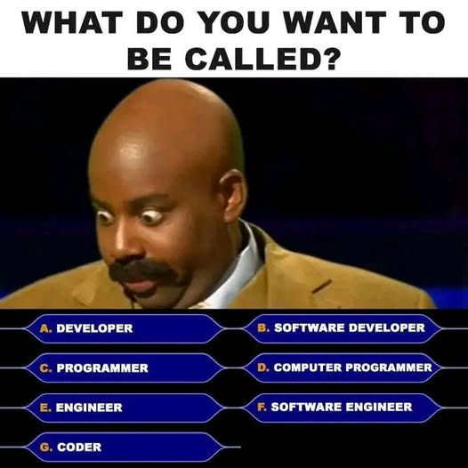

## Let's simplify things for now

- Most of us mostly use R
    - Ignore Python, Julia, etc.
- RStudio has tons of useful features
    - Ignore Terminal
    
. . .

<br>

Before getting to GitHub...

## Projects & directories

STOP using `setwd()` and `getwd()`

{fig-align="center"}

## Projects & directories

- R Projects!
    - Start viewing your projects as **modular** units
    - RStudio optimised for project workflows (e.g., multiple sessions)

## Projects & directories

{fig-align="center"}

# Okay, GitHub...

## 

{fig-align="center"}

##

1. Helping Future You
    - No idea what a script does?
    - Searchable log of project evolution
    - **Commits** force habit of documentation & **modularity**
2. Reproducibility as standard (journals, funders)
3. Structured time machine
    - No need to rebuild whole Jenga tower
4. Collaborating with safety net

##

Local work (saved files) = ideas in mind

Emailed files = coffee ramble

Git = jotted in personal notebook

GitHub = pages to hand out

. . .

{fig-align="center" height=400}

## Git/GitHub concepts

:::: {.columns}

::: {.column width="50%"}

- Repository
- Clones vs forks
- Commit-push-pull
- Diff
- Conflict

:::

::: {.column width="50%"}
- Branch
- Pull request
- Issue
- ...
:::

::::

# Repository

##

`github-intro`:

- [https://github.com/montanolab/github-intro](https://github.com/montanolab/github-intro)
- *Public* repository on *GitHub*
- Files/folders, commit history, repo details, settings, etc.
- Adding **collaborators** (public vs private repos)

## Clones vs forks

- How close are you to the project?
- Where do you want your changes to go?
    - *Whose hand-out pages? (GitHub thing)*
- Most cases: cloning

. . .

Collaborators, clone the repo!

# Commit-push-pull

## 

Let me:

- Create a new empty R script in the `scripts/` folder
- Name it with my name: `script_karthik.R`
- Save the new script
- Open the `Git` panel in RStudio
    - Git sees my changes
    - Formalise changes with a commit
    - Share "news" with a push

. . .

Now one of you!

## 

Always **pull before** working on new step! 

So it becomes **pull-commit-push**

## `.gitignore`

Tell Git to turn a blind eye to certain files from the start

Triple-check before committing data files!

. . .

```{r eval=FALSE, echo=TRUE}
# can ignore files
data/massive_data_file.xlsx

# but can also ignore folders
data_sensitive/
  
# or even all files of certain file type
*.pdf
*.docx
```

## Diff

Git sees everything, and can time travel within files!

What happens when I sign the README?

## Conflict

What happens when two people change the same thing?

. . .

Flavia, please sign the README and push your commit

. . .

<br>

Mismatch between local and remote

Let me try to push my signature

# Branch

##

{fig-align="center"}

## 

{fig-align="center"}

- Should be short-ish
- Main vs other: overall analysis vs finetuning model

## Pull request

- Let's all branch out 
- Create a branch with your name
- Create a script `script_NAME.R`
- Commit with message "branch & PR practice (#1)"
- Push commit(s)
- PR: Transfer your completed work to "main" project

## Issue

- Planning project evolution
- Document changes under bigger picture (why?)
    - All the changes associated with one goal

## Git/GitHub concepts

:::: {.columns}

::: {.column width="50%"}

- Repository
- Clones vs forks
- Commit-push-pull
- Diff
- Conflict

:::

::: {.column width="50%"}
- Branch
- Pull request
- Issue
- ...
:::

::::

## In practice

Peer review complete, need to make changes:

1. Filter data: use only 2008 & 2009
1. Update model: add `flipper_length_mm * species` interaction term
1. Update plot: use colour-blind--friendly palette

Let's update (on our own branches) and view changes

This time, reference #2

. . .

<br>

Useful for reviewers too

## 

1. Helping Future You
    - No idea what a script does?
    - Searchable log of project evolution
    - **Commits** force habit of documentation & **modularity**
2. Reproducibility as standard (journals, funders)
3. Structured time machine
    - Jenga: no need to rebuild whole tower
4. Collaborating with safety net

## 

{fig-align="center"}

##

- We can learn from more "mature" fields with time-tested best practices
- Overwhelm is not the solution
    - Hours into product, maximise impact
    - Mindset/value shift
    - Code review
    - Let's learn by doing!
    
. . .

These are flexible guidelines, adapt over time